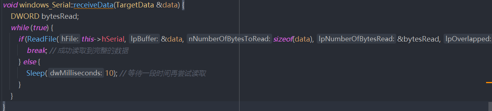
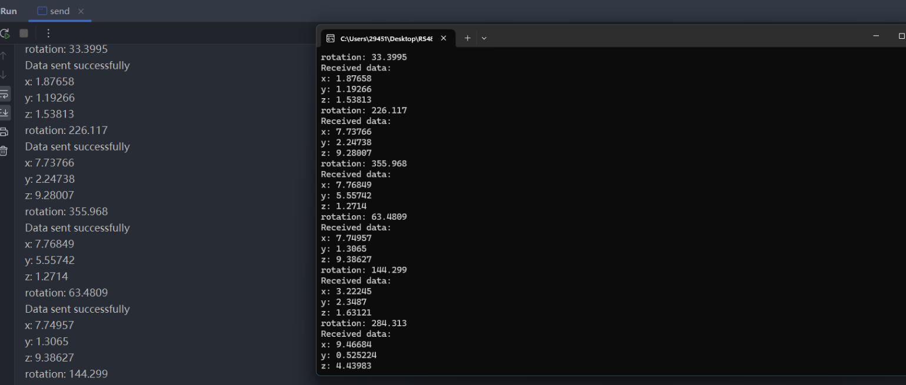

# WINDOWS下的C++串口编程
1. 串口编程的步骤：
2. 实例化串口类 windows_Serial sendport;windows_Serial receiveport;
3. 打开串口windows_Serial::open(const char *com, int rate ) 在windows下COMx,当x>=10时不能直接用"COM10"作为参数，需要\\\\.\COM10，所以统一使用\\\\.\，在配置时直接使用sendport.open(1, 115200)即可
4. 对串口的读写都配置了timeout
5. 在发送例程中以随机生成的数据模拟视觉识别的数据，以100hz频率发送
6. 在接收例程中建议以堵塞的方式等待接收数据，没有接收则不进行之后的程序

# 文件夹结构
receive 接收例程

send 发送例程

windows_Serial类文件
